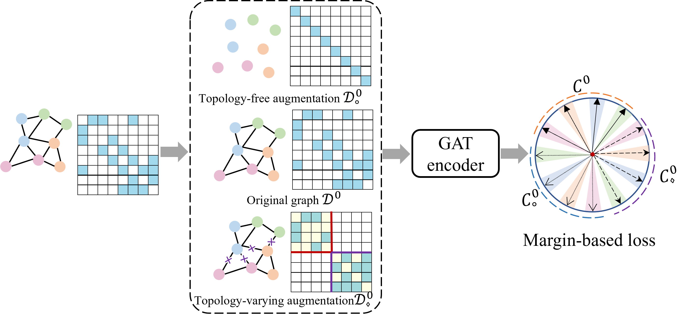
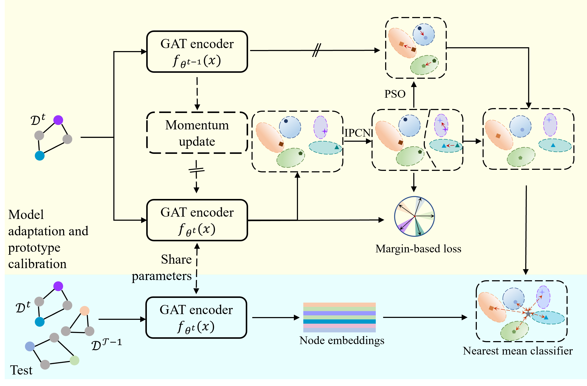

## Official Implementation of the TAP Paper

This code repository is the implementation of the paper "[Inductive Graph Few-shot Class Incremental Learning](https://arxiv.org/pdf/2411.06634)"

[//]: # (![Alt text]&#40;frame.png&#41;)
[//]: # (![Alt text]&#40;'figures/framework.png' "Optional title"&#41;)

<figure>
  
</figure>
<figure>
  
  <figcaption>The TAP framework</figcaption>
</figure>

## Requirements

<!-- ```plaintext -->
The primary environment requirements are listed here. 
- python==3.10.0
- torch==1.13.1
- torch-geometric==2.5.3 

<!-- ``` -->


## Running the Experiments

```python
python main.py --dataset Amazon_clothing  --way 5 --shot 5 --kmean_hops 5 --seed 2
python main.py --dataset cora_full --way 5 --shot 5 --kmean_hops 5 --seed 2
python main.py --dataset dblp  --way 10 --shot 5 --kmean_hops 3 --seed 2
```

### Citation
```
@article{li2024inductive,
  title={Inductive graph few-shot class incremental learning},
  author={Li, Yayong and Moghadam, Peyman and Peng, Can and Ye, Nan and Koniusz, Piotr},
  journal={Proceedings of the Eighteenth ACM International Conference on Web Search and Data Mining},
  year={2024}
}
```